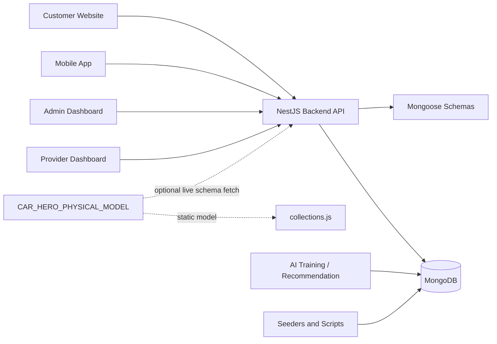
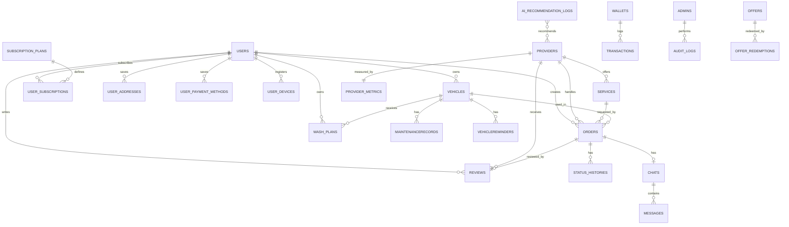
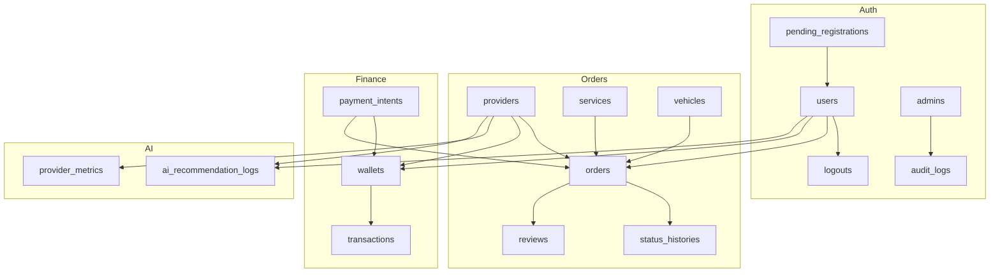
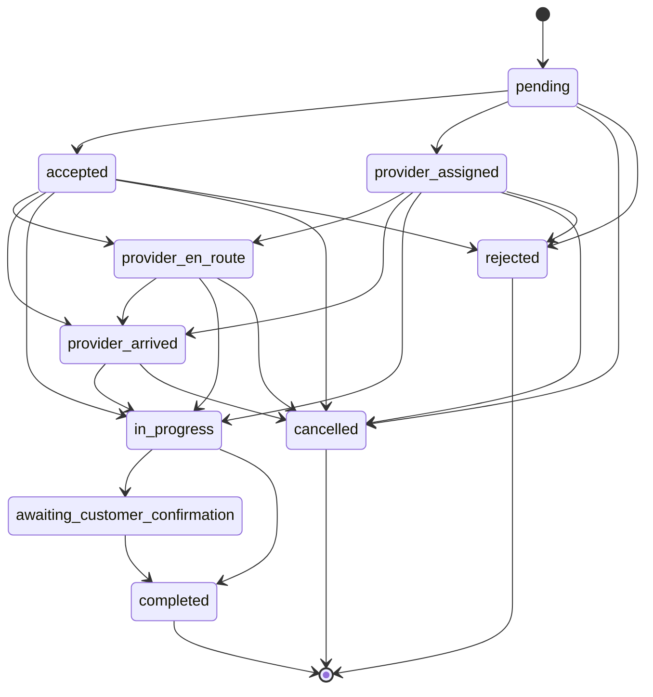
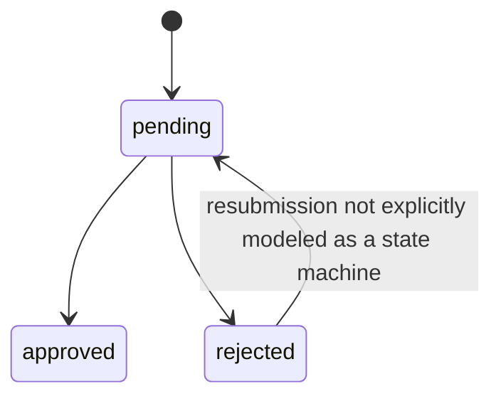
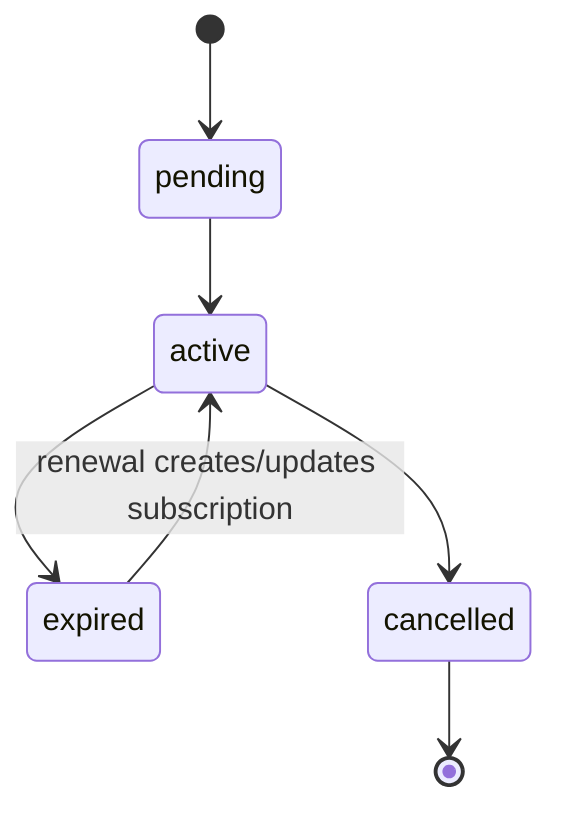
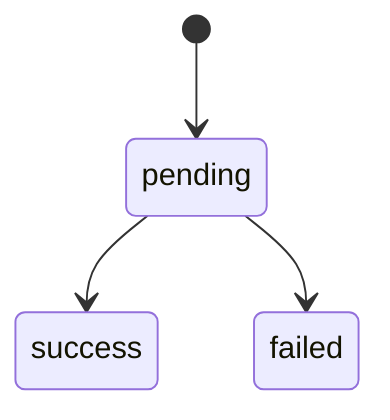
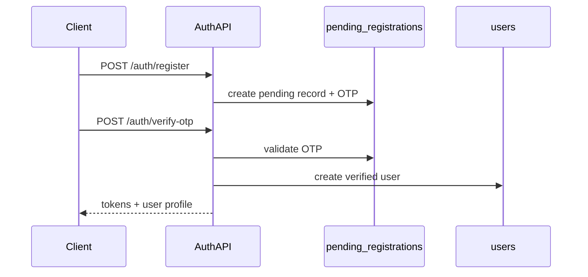

# CAR HERO Physical Database Model README

Generated: 2026-06-21  
Workspace: `e:\all_project\CarHero`  
Primary model project: `CAR_HERO_PHYSICAL_MODEL`  
Backend validation project: `CAR_HERO_BACKEND`

This document is the definitive technical reference for the CAR HERO physical data model as represented in the physical-model project and validated against the NestJS/Mongoose backend implementation. It documents only evidence found in the workspace. Runtime database contents were not inspected because no MongoDB dump, Compass export, or live database connection was provided during this documentation task.

## Table of Contents

1. [Documentation Methodology](#1-documentation-methodology)
2. [Executive Overview](#2-executive-overview)
3. [Database Technology and Storage Architecture](#3-database-technology-and-storage-architecture)
4. [Physical Model Project Structure](#4-physical-model-project-structure)
5. [Database Naming Conventions](#5-database-naming-conventions)
6. [Complete Collection Inventory](#6-complete-collection-inventory)
7. [Detailed Entity and Collection Documentation](#7-detailed-entity-and-collection-documentation)
8. [Primary Keys and Identifier Strategy](#8-primary-keys-and-identifier-strategy)
9. [Relationship Model](#9-relationship-model)
10. [Complete ERD and Relationship Diagrams](#10-complete-erd-and-relationship-diagrams)
11. [Embedded Documents Versus References](#11-embedded-documents-versus-references)
12. [Indexes](#12-indexes)
13. [Constraints and Validation Rules](#13-constraints-and-validation-rules)
14. [Enumeration and Status Catalog](#14-enumeration-and-status-catalog)
15. [State Transition Models](#15-state-transition-models)
16. [Orders and Booking Data Model](#16-orders-and-booking-data-model)
17. [Provider Data Model](#17-provider-data-model)
18. [User and Authentication Data Model](#18-user-and-authentication-data-model)
19. [Services and Categories Data Model](#19-services-and-categories-data-model)
20. [Vehicle Data Model](#20-vehicle-data-model)
21. [Reviews, Ratings, and Reputation Data Model](#21-reviews-ratings-and-reputation-data-model)
22. [Chat and Messaging Data Model](#22-chat-and-messaging-data-model)
23. [Notifications Data Model](#23-notifications-data-model)
24. [Subscription Data Model](#24-subscription-data-model)
25. [Wallet and Transaction Data Model](#25-wallet-and-transaction-data-model)
26. [Reports and Moderation Data Model](#26-reports-and-moderation-data-model)
27. [AI Recommendation and Analytics Data Model](#27-ai-recommendation-and-analytics-data-model)
28. [Geolocation and Map Data](#28-geolocation-and-map-data)
29. [Time and Date Model](#29-time-and-date-model)
30. [Soft Deletion, Archiving, and Data Retention](#30-soft-deletion-archiving-and-data-retention)
31. [Data Integrity Strategy](#31-data-integrity-strategy)
32. [Database Transactions and Atomic Operations](#32-database-transactions-and-atomic-operations)
33. [Query and Aggregation Inventory](#33-query-and-aggregation-inventory)
34. [Data Import, Seeding, and Migration](#34-data-import-seeding-and-migration)
35. [Excel Dataset Mapping](#35-excel-dataset-mapping)
36. [Data Ownership and System Consumers](#36-data-ownership-and-system-consumers)
37. [End-to-End Data Workflows](#37-end-to-end-data-workflows)
38. [Physical Model Versus Backend Consistency Audit](#38-physical-model-versus-backend-consistency-audit)
39. [Physical Model Versus Runtime Database Evidence](#39-physical-model-versus-runtime-database-evidence)
40. [Orphaned and Legacy Model Elements](#40-orphaned-and-legacy-model-elements)
41. [Security and Privacy Model](#41-security-and-privacy-model)
42. [Backup, Restore, and Environment Strategy](#42-backup-restore-and-environment-strategy)
43. [Performance and Scalability Considerations](#43-performance-and-scalability-considerations)
44. [Data Quality Rules](#44-data-quality-rules)
45. [Known Limitations and Technical Debt](#45-known-limitations-and-technical-debt)
46. [Recommendations](#46-recommendations)
47. [Database Developer Guide](#47-database-developer-guide)
48. [Glossary](#48-glossary)
49. [Complete Database Inventory Summary](#49-complete-database-inventory-summary)
50. [How the CAR HERO Physical Database Model Works Internally](#50-how-the-car-hero-physical-database-model-works-internally)

## 1. Documentation Methodology

The primary source of truth for the physical model is the React/Vite physical model application under `CAR_HERO_PHYSICAL_MODEL`.

Inspected physical-model sources:

- `CAR_HERO_PHYSICAL_MODEL/src/domain/entities/collections.js`: primary static collection and field model.
- `CAR_HERO_PHYSICAL_MODEL/src/domain/entities/relationships.js`: relationship list, diagram positions, and relation domain grouping.
- `CAR_HERO_PHYSICAL_MODEL/src/domain/entities/endpoints.js`: static backend endpoint coverage used by the model UI.
- `CAR_HERO_PHYSICAL_MODEL/src/domain/entities/domains.js`: domain classifications and visual categories.
- `CAR_HERO_PHYSICAL_MODEL/src/infrastructure/services/api.service.js`: live backend schema/OpenAPI fetch logic.
- `CAR_HERO_PHYSICAL_MODEL/src/infrastructure/services/schema.service.js`: collection normalization and field conversion.
- `CAR_HERO_PHYSICAL_MODEL/src/application/contexts/DiagramContext.jsx`: fallback-vs-live model behavior.
- `CAR_HERO_PHYSICAL_MODEL/README.md` and `package.json`.

Inspected backend validation sources:

- Mongoose schemas in `CAR_HERO_BACKEND/src/modules/**/schemas/*.ts`.
- Core enums in `CAR_HERO_BACKEND/src/core/enums/status.enum.ts` and `roles.enum.ts`.
- Database configuration in `CAR_HERO_BACKEND/src/config/env.config.ts` and `mongo.config.ts`.
- Seeders in `CAR_HERO_BACKEND/src/database/seeders/seed.ts` and `src/modules/subscriptions/.../subscription-plan.seeder.ts`.
- Query, aggregation, and transaction behavior in repositories/services such as `mongoose-wallet.repository.ts`, `admin-stats.service.ts`, and `customer-experience.service.ts`.
- AI and maps artifacts under `CAR_HERO_BACKEND/ai-training` and `CAR_HERO_BACKEND/maps-generator`.

Method:

- The physical model is treated as the documentation model.
- The Backend is used to validate fields, relationships, indexes, workflows, and inconsistencies.
- Runtime database state is not claimed as verified.
- Sensitive values from `.env` and hard-coded seed credentials were intentionally excluded.

## 2. Executive Overview

The CAR HERO database stores the operational state of a roadside assistance and vehicle-service platform:

- Customer accounts, authentication state, profiles, preferences, vehicles, addresses, payment methods, subscriptions, offers, and devices.
- Provider accounts, approval status, locations, service coverage, services, working hours, ratings, metrics, and payout data.
- Service catalog records used by the Website, Mobile App, Admin Dashboard, Provider Dashboard, and Backend order workflows.
- Orders and scheduled bookings as one unified `orders` collection, differentiated by `isScheduled` and `scheduledAt`.
- Order status history, notifications, chat conversations, standalone messages, reviews, wallets, transactions, AI recommendation logs, provider metrics, settings, and audit logs.

Applications depending on the model:

| Application | Database dependency |
|---|---|
| Customer Website | Reads services/providers and starts customer/provider onboarding flows through Backend APIs. |
| Mobile Application | Has a documented API contract and prototype screens; runtime API integration was documented separately as mostly simulated. |
| Admin Dashboard | Reads and manages users, providers, orders, subscriptions, finance, services, settings, audit logs, analytics, and map data. |
| Provider Dashboard | Reads provider profile, orders, services, working hours, wallet, and transactions. |
| Backend | Owns all direct database access through NestJS modules and Mongoose schemas. |
| AI recommendation component | Uses providers, orders, reviews, services, provider metrics, and `ai_recommendation_logs`. |
| Data scripts | Seed admin/service/subscription reference data and generate AI/map artifacts. |

High-level architecture:



## 3. Database Technology and Storage Architecture

| Technology | Evidence | Responsibility |
|---|---|---|
| MongoDB | `MONGODB_URI` in `CAR_HERO_BACKEND/.env.example`; local fallback in `env.config.ts` | Document database for platform collections. |
| Mongoose | `@nestjs/mongoose`, `mongoose` in `CAR_HERO_BACKEND/package.json`; `MongooseModule.forRootAsync(mongoConfig)` | ODM for schemas, indexes, validations, ObjectId references, aggregation, and transactions. |
| NestJS | `CAR_HERO_BACKEND/src/app.module.ts` | Backend application and module boundary. |
| MongoDB Atlas-style URI | `.env.example` uses `mongodb+srv://...` | Cloud connection template; runtime Atlas was not inspected. |
| Local MongoDB fallback | `env.config.ts` uses `mongodb://localhost:27017/car_hero` | Development fallback if `MONGODB_URI` is absent. |
| MongoMemoryServer tooling | `CAR_HERO_BACKEND/scripts/start-local-db.cjs` | Local development/testing database helper. |
| React/Vite physical model UI | `CAR_HERO_PHYSICAL_MODEL/package.json` | Visual documentation application for collections, relationships, and endpoints. |

Connection strategy:

- Backend loads environment via `ConfigModule.forRoot`.
- `mongo.config.ts` passes `database.uri` to `MongooseModule.forRootAsync`.
- Connection options include `retryWrites: true` and `w: 'majority'`.
- Mongoose timestamps store `createdAt` and `updatedAt` as dates where `timestamps: true` is enabled.

Identifier strategy:

- Primary IDs are MongoDB `ObjectId`.
- Human-readable secondary IDs exist for `orders.orderNumber` and `transactions.transactionNumber`.
- References are mostly application-level Mongoose ObjectIds; MongoDB does not enforce foreign keys.
- Polymorphic references exist in wallets, transactions, notifications, status histories, chats/messages, and AI logs.

## 4. Physical Model Project Structure

Physical model tree, excluding generated folders:

```text
CAR_HERO_PHYSICAL_MODEL/
  README.md
  package.json
  vite.config.js
  tailwind.config.js
  index.html
  public/
    logo_carHero.png
  src/
    App.jsx
    main.jsx
    application/contexts/
      DiagramContext.jsx
      diagram-context.js
    domain/entities/
      collections.js
      relationships.js
      endpoints.js
      domains.js
      translations.js
    infrastructure/services/
      api.service.js
      export.service.js
      schema.service.js
    presentation/
      pages/Dashboard.jsx
      components/canvas/
      components/collections/
      components/endpoints/
      components/ui/
      styles/index.css
```

Important files:

| File | Purpose | Source-of-truth status |
|---|---|---|
| `src/domain/entities/collections.js` | Static list of modeled collections, fields, indexes, purpose, module source paths. | Primary physical model source. |
| `src/domain/entities/relationships.js` | Inter-collection relationships and diagram positions. | Primary relationship model source. |
| `src/domain/entities/endpoints.js` | Static API endpoint map used by the UI when live OpenAPI is unavailable. | Supporting endpoint model. |
| `src/infrastructure/services/api.service.js` | Attempts to fetch `/api/v1/system/schemas` and `/api-docs-json` from `http://localhost:3001`. | Live enrichment path, not the static source. |
| `src/application/contexts/DiagramContext.jsx` | Chooses live backend data if reachable, otherwise static local data. | Behavior source for model UI. |
| `README.md` | Defines app purpose and commands. | Project usage reference. |

No `.drawio`, `.mmd`, Lucidchart, BSON dump, or exported database model files were found. The physical model is implemented as a ReactFlow-style documentation app, not as a standalone ERD file.

## 5. Database Naming Conventions

Observed conventions:

| Area | Convention |
|---|---|
| Collections | Lowercase plural names, sometimes snake_case for explicit collections (`pending_registrations`, `status_histories`, `user_addresses`) and Mongoose default compact plurals for some class names (`maintenancerecords`, `vehiclereminders`). |
| Fields | camelCase (`fullName`, `phoneNumber`, `createdAt`). |
| Primary key | `_id` ObjectId. |
| References | Usually ObjectId fields named after target (`user`, `provider`, `service`, `vehicle`) or explicit IDs (`userId`, `ownerId`, `recipientId`). |
| Polymorphic refs | ID plus type fields (`ownerId` + `ownerType`, `recipientId` + `recipientType`). |
| Status fields | `status`, `registrationStatus`, `paymentStatus`, `deliveryStatus`, `isActive`, `isApproved`, `isRead`. |
| Booleans | `is*` and `has*` style (`isActive`, `isScheduled`, `isDefault`, `isPremium`). |
| Timestamps | `createdAt`, `updatedAt`, plus domain-specific timestamps (`acceptedAt`, `completedAt`, `cancelledAt`). |
| Enums | lowercase string values (`pending`, `completed`, `provider_assigned`). |
| Index names | Not explicitly named; indexes are defined by fields in Mongoose. |

Naming inconsistencies:

- Vehicle ownership/manufacturer naming now uses Backend-aligned `owner` and `brand`.
- Provider address data includes both `state` and `governorate`, matching the Backend provider schema.
- Some older provider import fields use snake-like names such as `services_list` and `is_emergency`.
- `SubscriptionStatus` enum includes `inactive`, but `user_subscriptions.status` schema allows `active`, `expired`, `cancelled`, and `pending`.

## 6. Complete Collection Inventory

| Collection | Logical name | Domain | Physical model | Backend schema | Seeder/import/script evidence | Main consumers |
|---|---|---:|---:|---:|---|---|
| `users` | Customer accounts | Accounts/Auth | Yes | Yes | Auth/user services | Website, Mobile, Admin, Backend |
| `admins` | Admin accounts | Accounts/Admin | Yes | Yes | `seed.ts` creates admin accounts | Admin Dashboard |
| `audit_logs` | Admin audit trail | System | Yes | Yes | Admin/audit services | Admin Dashboard |
| `providers` | Service providers | Providers | Yes | Yes | Provider import fields and admin services | Website, Mobile, Admin, Provider Dashboard |
| `services` | Service catalog | Services | Yes | Yes | `seed.ts` seeds services | All apps |
| `vehicles` | User vehicles | Vehicles | Yes | Yes | Vehicle module | Mobile, Backend, Admin |
| `maintenancerecords` | Vehicle maintenance history | Vehicles | Yes | Yes | Vehicle module | Mobile/Admin via Backend |
| `vehiclereminders` | Vehicle reminders | Vehicles | Yes | Yes | Vehicle module | Mobile/Admin via Backend |
| `orders` | Orders and scheduled bookings | Orders | Yes | Yes | Order workflows and wash-plan generation | All apps |
| `status_histories` | Order status timeline | Orders | Yes | Yes | Status history service | Admin/Provider/Backend |
| `wallets` | User/provider wallets | Finance | Yes | Yes | Wallet repository | Mobile, Provider Dashboard, Admin |
| `transactions` | Wallet ledger | Finance | Yes | Yes | Wallet repository and payout flows | Provider Dashboard, Admin |
| `subscription_plans` | Subscription catalog | Subscriptions | Yes | Yes | Seeders | Website/Mobile/Admin |
| `user_subscriptions` | Purchased subscriptions | Subscriptions | Yes | Yes | Subscription repository | Mobile/Admin/Backend |
| `chats` | Conversation threads | Communication | Yes | Yes | Chat service/gateway | Mobile/Backend |
| `messages` | Standalone chat messages | Communication | Yes | Yes | Chat service/gateway | Mobile/Backend |
| `notifications` | In-app notifications | Communication | Yes | Yes | Notification service/gateway | All authenticated apps |
| `reviews` | Reviews and ratings | Quality | Yes | Yes | Review/order workflows | Website/Mobile/Admin/Provider |
| `settings` | Platform settings | System | Yes | Yes | Admin settings services | Backend/Admin/Public settings |
| `pending_registrations` | Temporary OTP registration state | Auth | Yes | Yes | Auth service | Website/Mobile/Backend |
| `logouts` | Logout/session records | Auth | Yes | Yes | Auth/Admin logout | Backend/Admin |
| `provider_metrics` | AI provider metrics | AI | Yes | Yes | AI metrics service | AI/Admin |
| `ai_recommendation_logs` | Recommendation audit/training data | AI | Yes | Yes | AI recommendation/training scripts | AI/Admin |
| `user_addresses` | Saved customer addresses | Customer Experience | Yes | Yes | Customer experience service | Mobile/Backend |
| `user_payment_methods` | Saved payment methods | Customer Experience | Yes | Yes | Customer experience service | Mobile/Backend |
| `offers` | Promotions | Customer Experience | Yes | Yes | Customer/admin offers | Mobile/Admin |
| `offer_redemptions` | Offer claims | Customer Experience | Yes | Yes | Offer application flow | Backend/Admin |
| `wash_plans` | Recurring wash plans | Customer Experience | Yes | Yes | Customer experience cron | Mobile/Backend |
| `user_devices` | Push/device tokens | Customer Experience | Yes | Yes | Device registration | Mobile/Backend |
| `payment_intents` | Payment initiation state | Payments | Yes | Yes | Payment module | Backend/payment flows |

## 7. Detailed Entity and Collection Documentation

The following subsections document every collection represented in the updated physical model and validated against the inspected Backend schemas.

### 7.1 `users`

Identity:

- Business purpose: customer account, authentication, preferences, premium state, notification token, vehicle/subscription references.
- Physical source: `CAR_HERO_PHYSICAL_MODEL/src/domain/entities/collections.js`.
- Backend source: `CAR_HERO_BACKEND/src/modules/users/infrastructure/persistence/mongoose/schemas/user.schema.ts`.
- Ownership: created by auth registration/verification; updated by auth/profile/admin/customer flows.

Field dictionary:

| Field | Type | Rules and meaning |
|---|---|---|
| `_id` | ObjectId | MongoDB primary key. |
| `fullName` | String | Required display name. |
| `phoneNumber` | String | Required, unique, `+963` plus 9 digits. |
| `password` | String | Required, `select:false`, hashed, removed from JSON. |
| `profileImage` | String/null | Optional URL, default null. |
| `accountType` | String enum | `customer`, `provider`, `admin`; default `customer`. |
| `role` | Role enum | Authorization role; default `user`. |
| `loyaltyLevel` | Number | Default 1, minimum 1. |
| `isPremium` | Boolean | Default false. |
| `premiumExpiresAt` | Date/null | Premium expiration. |
| `preferences` | Object | language plus push/SMS/email preferences. |
| `isActive` | Boolean | Account enabled. |
| `isTermsAccepted` | Boolean | Terms acceptance. |
| `isVerified` | Boolean | Phone/account verification. |
| `lastLoginAt` | Date/null | Login timestamp. |
| `otpCode` | String/null | Hidden OTP code. |
| `otpExpiresAt` | Date/null | Hidden OTP expiration. |
| `otpAttempts` | Number | Hidden attempt counter. |
| `refreshToken` | String/null | Hidden refresh token. |
| `fcmToken` | String | Push token. |
| `vehicles` | ObjectId[] -> `vehicles` | Vehicle references. |
| `activeSubscription` | ObjectId -> `user_subscriptions` | Current subscription. |
| `createdAt` / `updatedAt` | Date | Automatic timestamps. |

Lifecycle and operations:

- Created after OTP verification.
- Read during login, profile, admin user management, wallet ownership, orders, subscriptions, notifications, reviews.
- Updated for verification, token refresh, profile edits, premium/subscription linkage, push token, active status.
- Deletion exists through admin/user management services; no database-enforced cascade was found.

Illustrative sanitized example:

```json
{
  "_id": "665000000000000000000001",
  "fullName": "Sample Customer",
  "phoneNumber": "+963900000000",
  "accountType": "customer",
  "role": "user",
  "isVerified": true,
  "isActive": true,
  "vehicles": ["665000000000000000000101"]
}
```

### 7.2 `admins`

Identity:

- Purpose: admin-dashboard accounts and admin authentication.
- Backend source: `admin.schema.ts`.
- Ownership: created by seed/admin management.

Field dictionary:

| Field | Type | Rules and meaning |
|---|---|---|
| `_id` | ObjectId | Primary key. |
| `name` | String | Required display name. |
| `email` | String | Required, unique login identifier. |
| `password` | String | Required, hidden hashed password. |
| `role` | Role enum | Defaults to `admin`. |
| `permissions` | String[] | Metadata permissions; admin access is otherwise role-based. |
| `isActive` | Boolean | Enabled/disabled state. |
| `lastLoginAt` | Date | Last login timestamp. |
| `avatar` | String | Optional avatar. |
| `lastLoginIp` | String | Last login IP. |
| `refreshToken` | String | Hidden refresh token. |
| `metadata` | Object | Flexible metadata. |
| `createdAt` / `updatedAt` | Date | Automatic timestamps. |

Lifecycle and operations:

- Created by `seed.ts` and admin management endpoints.
- Updated on login and status/permission/password changes.
- Used by `audit_logs` as actor reference.
- Hard-coded seed credentials exist in `seed.ts`; actual values are intentionally not reproduced here.

### 7.3 `audit_logs`

Identity:

- Purpose: immutable-like audit trail for sensitive admin actions.
- Backend source: `audit-log.schema.ts`.

Fields:

| Field | Type | Rules and meaning |
|---|---|---|
| `_id` | ObjectId | Primary key. |
| `admin` | ObjectId -> `admins` | Optional actor reference. |
| `adminEmail`, `adminName` | String | Actor snapshots. |
| `action` | String | Required action key. |
| `entityType` | String | Required affected entity type. |
| `entityId` | ObjectId | Optional affected document. |
| `summary` | String | Human-readable action summary. |
| `before`, `after`, `metadata` | Object | Snapshots and extra details. |
| `ipAddress`, `userAgent` | String | Request metadata. |
| `createdAt` / `updatedAt` | Date | Timestamps. |

Lifecycle:

- Created by admin services for provider, service, settings, wallet payout, and admin actions.
- Read by admin audit-log endpoints and analytics.
- No deletion/retention policy was found.

### 7.4 `providers`

Identity:

- Purpose: workshops/technicians including status, approval, location, services, schedule, ratings, and payment profile.
- Backend source: `provider.schema.ts`.

Field dictionary from the physical model:

| Field | Type | Rules and meaning |
|---|---|---|
| `_id` | ObjectId | Primary key. |
| `phone` | String | Required, unique. |
| `email` | String | Optional. |
| `businessName` | String | Required public provider name. |
| `ownerName` | String | Owner/person responsible. |
| `description` | String | Public profile text. |
| `logo`, `images` | String / String[] | Provider media. |
| `role` | Role enum | Defaults to `provider`. |
| `status` | ProviderStatus | `online`, `offline`, `busy`. |
| `registrationStatus` | RegistrationStatus | `pending`, `approved`, `rejected`. |
| `rejectionReason` | String | Admin rejection reason. |
| `isApproved`, `isActive` | Boolean | Approval and account enablement. |
| `location` | GeoJSON Point | Required `[longitude, latitude]`. |
| `address`, `city`, `state`, `country`, `postalCode` | String | Address/search fields. |
| `serviceCategories` | ServiceCategory[] | Category capabilities. |
| `services` | ObjectId[] -> `services` | Concrete offered services. |
| `workingHours` | Object[] | Embedded day/open/close/isClosed schedule. |
| `averageRating`, `totalReviews`, `totalOrders` | Number | Cached reputation/statistics. |
| `otp`, `otpExpiry`, `refreshToken` | String/Date | Hidden auth/session fields. |
| `fcmToken` | String | Push token. |
| `documents` | String[] | Verification document URLs. |
| `bankAccount` | Object | Bank account subdocument. |
| `commissionRate` | Number | Default 10 percent. |
| `lastOnlineAt` | Date | Last online timestamp. |
| `createdAt` / `updatedAt` | Date | Timestamps. |

Additional provider fields now included in the updated physical model:

- `website`, `facebookUrl`, `businessType`, `category`, `slug`, `plusCode`, `googleId`.
- `accountStatus`, `accountType`, `governorate`, `coverageAreas`.
- `requestedServices`, `services_list`, `servicePrices`, `serviceAvailability`.
- `emergency247`, `is_emergency`, `serviceRadiusKm`, `paymentMethods`, `facilities`, `experienceYears`, `techCount`, `tags`, `isPhoneVerified`, `shopPhotos`.

Lifecycle:

- Created by provider registration/import/admin flows.
- Moves through `registrationStatus`: `pending` -> `approved` or `rejected`.
- Availability is represented separately by `status`.
- Updated by provider dashboard services/working-hours/settings and admin approval/rejection.

### 7.5 `services`

Identity:

- Purpose: service catalog, both system-wide and provider-specific.
- Backend source: `service.schema.ts`.

Fields:

| Field | Type | Rules and meaning |
|---|---|---|
| `_id` | ObjectId | Primary key. |
| `name`, `nameAr` | String | Required service names. |
| `description`, `descriptionAr` | String | Optional descriptions. |
| `category` | ServiceCategory | Required indexed category. |
| `basePrice`, `discountedPrice` | Number | Price fields, min 0. |
| `estimatedDuration` | Number | Required minutes, min 1. |
| `icon`, `image` | String | Visual metadata. |
| `isEmergency`, `isActive`, `isSystemService` | Boolean | Visibility and service type flags. |
| `sortOrder` | Number | Display order. |
| `provider` | ObjectId -> `providers` | Optional provider-specific owner. |
| `options` | Object[] | Add-ons. |
| `metadata` | Object | Flexible metadata. |
| `createdAt` / `updatedAt` | Date | Timestamps. |

Lifecycle:

- Created by `seed.ts` or admin service management.
- Provider-specific services may reference a provider.
- Used by orders for price/duration and provider eligibility.

### 7.6 `vehicles`

Identity:

- Purpose: customer-owned vehicles.
- Physical source and Backend source both use `owner` and `brand`.
- Backend source: `vehicle.schema.ts`.

Field dictionary:

| Field | Type | Rules and meaning |
|---|---|---|
| `_id` | ObjectId | Primary key. |
| `owner` | ObjectId -> `users` | Required vehicle owner. |
| `brand` | String | Required manufacturer/brand. |
| `model` | String | Required model. |
| `year` | Number | Required manufacturing year. |
| `plateNumber` | String | Required plate number. |
| `color`, `vin`, `image` | String | Optional metadata. |
| `isActive`, `isDefault` | Boolean | Usability/default flags. |
| `metadata` | Object | Extra vehicle data. |
| `createdAt` / `updatedAt` | Date | Timestamps. |

### 7.7 `maintenancerecords`

Purpose: maintenance history for vehicles.  
Backend source: `maintenance-record.schema.ts`.

| Field | Type | Rules and meaning |
|---|---|---|
| `_id` | ObjectId | Primary key. |
| `vehicle` | ObjectId -> `vehicles` | Required, indexed. |
| `user` | ObjectId -> `users` | Required owner. |
| `serviceType` | String | Required maintenance type. |
| `description` | String | Optional. |
| `date` | Date | Defaults to now. |
| `mileage`, `cost` | Number | Optional, minimum 0. |
| `provider`, `location`, `invoiceNumber`, `notes` | String | Optional text metadata. |
| `parts`, `attachments` | String[] | Lists. |
| `createdAt` / `updatedAt` | Date | Timestamps. |

### 7.8 `vehiclereminders`

Purpose: maintenance reminders and recurring vehicle tasks.  
Backend source: `vehicle-reminder.schema.ts`.

| Field | Type | Rules and meaning |
|---|---|---|
| `_id` | ObjectId | Primary key. |
| `vehicle` | ObjectId -> `vehicles` | Required, indexed. |
| `user` | ObjectId -> `users` | Required owner. |
| `type` | ReminderType | Required enum. |
| `title` | String | Required. |
| `description` | String | Optional. |
| `reminderDate` | Date | Optional date trigger. |
| `mileageThreshold`, `currentMileage` | Number | Optional mileage triggers. |
| `frequency` | ReminderFrequency | Optional enum. |
| `isActive`, `isRecurring` | Boolean | Reminder state. |
| `lastTriggeredAt` | Date | Last trigger. |
| `notes` | String | Optional. |
| `createdAt` / `updatedAt` | Date | Timestamps. |

### 7.9 `orders`

Purpose: unified service request collection for immediate orders and scheduled bookings.  
Backend source: `order.schema.ts`.

| Field | Type | Rules and meaning |
|---|---|---|
| `_id` | ObjectId | Primary key. |
| `orderNumber` | String | Required, unique human-readable number. |
| `user` | ObjectId -> `users` | Required customer. |
| `provider` | ObjectId -> `providers` | Optional assigned provider. |
| `service` | ObjectId -> `services` | Required service. |
| `vehicle` | ObjectId -> `vehicles` | Optional vehicle. |
| `status` | OrderStatus | Defaults to `pending`. |
| `totalAmount`, `discountAmount`, `payableAmount` | Number | Pricing fields. |
| `location` | GeoJSON Point | Required service location. |
| `providerLocation` | GeoJSON Point | Latest provider tracking point. |
| `providerLocationUpdatedAt` | Date | Tracking timestamp. |
| `providerLocationHistory` | ProviderLocationPoint[] | Bounded location trail. |
| `address` | String | Readable address. |
| `isScheduled` | Boolean | Scheduled booking flag. |
| `scheduledAt` | Date | Scheduled time. |
| `paymentStatus` | PaymentStatus | Defaults to `pending`. |
| `paymentMethod` | PaymentMethod | Defaults to `cash`. |
| `paymentId` | String | External payment reference. |
| `userNotes`, `providerNotes` | String | Notes. |
| `images` | String[] | Optional evidence/images. |
| `acceptedAt`, `startedAt`, `completedAt` | Date | Lifecycle timestamps. |
| `completionRequestedAt`, `customerConfirmedAt` | Date | Completion confirmation timestamps. |
| `cancelledAt`, `cancellationReason`, `cancelledBy` | Date/String | Cancellation audit fields. |
| `review` | ObjectId -> `reviews` | Review reference. |
| `rating` | Number | Quick rating. |
| `metadata` | Object | Flexible data such as schedule duration or redeemed points. |
| `createdAt` / `updatedAt` | Date | Timestamps. |

Lifecycle:

- Created by `CreateOrderUseCase`.
- Initial status is `pending`.
- Scheduled bookings are stored in the same collection using `isScheduled=true` and `scheduledAt`.
- Status changes are validated by `OrderStateMachine`.
- Status changes append `status_histories`.
- Completion may transfer earnings to provider wallet.
- Cancellation may refund wallet/points.

### 7.10 `status_histories`

Purpose: append-only timeline of order status changes.  
Backend source: `status-history.schema.ts`.

| Field | Type | Rules and meaning |
|---|---|---|
| `_id` | ObjectId | Primary key. |
| `entityType` | String | Defaults to `order`. |
| `entityId` | ObjectId -> `orders` | Required tracked order. |
| `orderNumber` | String | Snapshot for lookup. |
| `fromStatus`, `toStatus` | String | Transition values. |
| `changedBy` | ObjectId | Polymorphic actor id. |
| `changedByRole`, `changedByType` | String | Actor snapshots. |
| `reason` | String | Optional reason. |
| `metadata` | Object | Extra context. |
| `createdAt` / `updatedAt` | Date | Timestamps. |

### 7.11 `wallets`

Purpose: polymorphic wallet for users, providers, and logically `system` owners in repository code.  
Backend source: `wallet.schema.ts`.

| Field | Type | Rules and meaning |
|---|---|---|
| `_id` | ObjectId | Primary key. |
| `ownerId` | ObjectId/string | Required owner id. |
| `ownerType` | String | `user`, `provider`, and repository also supports `system`. |
| `balance`, `loyaltyPoints`, `pendingBalance` | Number | Financial counters, default 0. |
| `currency` | String | Defaults to `SAR` in schema. |
| `isActive` | Boolean | Wallet enabled. |
| `metadata` | Object | Flexible metadata. |
| `createdAt` / `updatedAt` | Date | Timestamps. |

### 7.12 `transactions`

Purpose: wallet ledger.  
Backend source: `wallet.schema.ts`.

| Field | Type | Rules and meaning |
|---|---|---|
| `_id` | ObjectId | Primary key. |
| `transactionNumber` | String | Required, unique. |
| `wallet` | ObjectId -> `wallets` | Required wallet. |
| `ownerId`, `ownerType` | ObjectId/String | Owner snapshot. |
| `type` | TransactionType | Required type. |
| `amount`, `balanceBefore`, `balanceAfter` | Number | Required financial values. |
| `description` | String | Required text. |
| `referenceType`, `referenceId` | String/ObjectId | Related business object. |
| `paymentMethod`, `paymentId` | String | Optional payment metadata. |
| `status` | String | `pending`, `completed`, `failed`, `reversed`; schema is free string with default `completed`. |
| `pointsEarned`, `pointsRedeemed` | Number | Loyalty counters. |
| `metadata` | Object | Extra data. |
| `createdAt` / `updatedAt` | Date | Timestamps. |

Additional index included in the updated physical model:

- The Backend and updated physical model include a partial unique index for order loyalty-point transactions: `{ ownerId, referenceType, referenceId, type }` unique when `referenceType='order'` and `type='loyalty_points'`.

### 7.13 `subscription_plans`

Purpose: subscription catalog.  
Backend source: `subscription-plan.schema.ts`.

| Field | Type | Rules and meaning |
|---|---|---|
| `_id` | ObjectId | Primary key. |
| `name`, `nameAr` | String | Required names. |
| `description`, `descriptionAr` | String | Optional descriptions. |
| `price` | Number | Required, minimum 0. |
| `durationDays` | Number | Required, minimum 1. |
| `features`, `featuresAr` | String[] | Feature lists. |
| `isActive` | Boolean | Purchasable flag. |
| `tier` | String enum | `basic`, `silver`, `gold`, `platinum`. |
| `sortOrder` | Number | Display order. |
| `metadata` | Object | Flexible metadata. |
| `createdAt` / `updatedAt` | Date | Timestamps. |

Seeder contract note:

- `seed.ts` attempts to create fields such as subscription discounts and benefits that are not in the visible schema. With default Mongoose strict behavior, extra fields are not a reliable persisted contract.

### 7.14 `user_subscriptions`

Purpose: user subscription history/current plan.  
Backend source: `user-subscription.schema.ts`.

| Field | Type | Rules and meaning |
|---|---|---|
| `_id` | ObjectId | Primary key. |
| `user` | ObjectId -> `users` | Required. |
| `plan` | ObjectId -> `subscription_plans` | Required. |
| `startDate`, `endDate` | Date | Required period. |
| `status` | String enum | `active`, `expired`, `cancelled`, `pending`. |
| `autoRenew` | Boolean | Defaults true. |
| `cancelledAt` | Date | Cancellation timestamp. |
| `lastPaymentId` | String | Payment reference. |
| `amountPaid` | Number | Required amount. |
| `metadata` | Object | Extra data. |
| `createdAt` / `updatedAt` | Date | Timestamps. |

### 7.15 `chats`

Purpose: order conversation container; individual messages are stored in the standalone `messages` collection.  
Backend source: `chat.schema.ts`.

| Field | Type | Rules and meaning |
|---|---|---|
| `_id` | ObjectId | Primary key. |
| `orderId` | ObjectId -> `orders` | Required. |
| `participants` | ObjectId[] | Required polymorphic participant IDs. |
| `isActive` | Boolean | Conversation open flag. |
| `lastMessageAt`, `lastMessage`, `lastMessageBy` | Date/String/ObjectId | Conversation preview fields. |
| `unreadCounts` | Map<string, number> | Per-participant unread counts. |
| `createdAt` / `updatedAt` | Date | Timestamps. |

### 7.16 `messages`

Purpose: standalone chat messages.  
Backend source: `chat.schema.ts`.

| Field | Type | Rules and meaning |
|---|---|---|
| `_id` | ObjectId | Primary key. |
| `chatId` | ObjectId -> `chats` | Required. |
| `senderId`, `receiverId` | ObjectId | Required polymorphic participants. |
| `message` | String | Required content. |
| `type` | String enum | `text`, `image`, `location`, `voice`. |
| `sentAt` | Date | Defaults to now. |
| `isRead` | Boolean | Read flag. |
| `fileUrl` | String | Optional attachment URL. |
| `location` | Object | Optional location payload. |
| `readAt` | Date | Read timestamp. |
| `createdAt` / `updatedAt` | Date | Timestamps. |

### 7.17 `notifications`

Purpose: in-app notifications for user, provider, and admin recipients.  
Backend source: `notification.schema.ts`.

| Field | Type | Rules and meaning |
|---|---|---|
| `_id` | ObjectId | Primary key. |
| `recipientId` | ObjectId | Required polymorphic recipient id. |
| `recipientType` | String enum | `user`, `provider`, `admin`. |
| `title`, `body` | String | Required notification text. |
| `type` | NotificationType | Required category. |
| `data` | Object | Flexible payload. |
| `isRead`, `readAt` | Boolean/Date | Read state. |
| `campaignId` | String | Optional campaign or batch identifier. |
| `audience` | Object | Optional campaign audience descriptor. |
| `deliveryStatus` | String enum | `pending`, `sent`, `failed`; used for delivery scheduling. |
| `scheduledAt`, `sentAt` | Date | Optional scheduling and dispatch timestamps. |
| `createdAt` / `updatedAt` | Date | Timestamps. |

### 7.18 `reviews`

Purpose: customer feedback and provider reputation.  
Backend source: `review.schema.ts`.

| Field | Type | Rules and meaning |
|---|---|---|
| `_id` | ObjectId | Primary key. |
| `user` | ObjectId -> `users` | Required author. |
| `provider` | ObjectId -> `providers` | Required target provider. |
| `order` | ObjectId -> `orders` | Optional, unique sparse index. |
| `rating` | Number | Required 1..5. |
| `comment` | String | Optional. |
| `serviceQuality`, `punctuality`, `professionalism`, `valueForMoney` | Number | Optional 1..5 dimensions. |
| `images` | String[] | Optional review images. |
| `isReported`, `reportReason` | Boolean/String | Report state. |
| `response`, `providerResponse`, `providerRespondedAt` | Object/String/Date | Provider response data. |
| `isVisible`, `isFlagged`, `flagReason` | Boolean/String | Moderation flags. |
| `helpfulCount`, `helpfulVoters` | Number/ObjectId[] | Helpful votes. |
| `createdAt` / `updatedAt` | Date | Timestamps. |

### 7.19 `settings`

Purpose: platform settings and maintenance mode values.  
Backend source: `setting.schema.ts`.

| Field | Type | Rules and meaning |
|---|---|---|
| `_id` | ObjectId | Primary key. |
| `key` | String | Required, unique. |
| `value` | Object/Mixed | Required value. |
| `maintenanceMode` | Boolean | Global maintenance flag. |
| `maintenanceMessage`, `maintenanceMessageAr` | String | Maintenance texts. |
| `description` | String | Human-readable note. |
| `group` | String | Defaults to `general`. |
| `isPublic` | Boolean | Public visibility. |
| `createdAt` / `updatedAt` | Date | Timestamps. |

### 7.20 `pending_registrations`

Purpose: temporary registration state before OTP verification.  
Backend source: `pending-registration.schema.ts`.

| Field | Type | Rules and meaning |
|---|---|---|
| `_id` | ObjectId | Primary key. |
| `phoneNumber` | String | Required, unique, trimmed. |
| `fullName` | String | Required. |
| `password` | String | Required, hidden hashed password. |
| `accountType` | String enum | `customer`, `provider`, `admin`. |
| `isTermsAccepted` | Boolean | Required. |
| `otpCode`, `otpExpiresAt`, `otpAttempts` | String/Date/Number | Hidden OTP state. |
| `expiresAt` | Date TTL | `expires: 600` seconds. |
| `createdAt` / `updatedAt` | Date | Timestamps. |

### 7.21 `logouts`

Purpose: logout/session security history.  
Backend source: `logout.schema.ts`.

| Field | Type | Rules and meaning |
|---|---|---|
| `_id` | ObjectId | Primary key. |
| `userId` | ObjectId -> `users` | Required. |
| `refreshTokenHash` | String | Required. |
| `ipAddress`, `userAgent` | String | Client metadata. |
| `success` | Boolean | Defaults true. |
| `reason` | String enum | `manual`, `expired`, `forced`, `security`. |
| `createdAt` / `updatedAt` | Date | Timestamps. |

### 7.22 `provider_metrics`

Purpose: provider performance metrics for AI ranking.  
Backend source: `provider-metrics.schema.ts`.

Fields:

| Field | Type | Rules and meaning |
|---|---|---|
| `_id` | ObjectId | Primary key. |
| `provider` | ObjectId -> `providers` | Required, unique. |
| `totalOrders`, `completedOrders`, `cancelledOrders`, `failedOrders` | Number | Counts. |
| `completionRate`, `cancellationRate`, `averageRating` | Number | Ratios/scores. |
| `totalReviews` | Number | Review count. |
| `averageResponseTime`, `averageArrivalTime` | Number | Minutes. |
| `serviceSpecializationScores` | Map<string, number> | Scores by service category. |
| `cityPerformance` | Map | City performance details. |
| `last30DaysPerformance`, `peakHourPerformance` | Embedded objects | Periodic performance. |
| `createdAt` / `updatedAt` | Date | Timestamps. |

### 7.23 `ai_recommendation_logs`

Purpose: recommendation request audit, ranking output, and training feedback.  
Backend source: `ai-recommendation-log.schema.ts`.

| Field | Type | Rules and meaning |
|---|---|---|
| `_id` | ObjectId | Primary key. |
| `user` | ObjectId -> `users` | Optional requester. |
| `criteria` | InputCriteria | serviceCategory, city, location, urgency, preferred time, vehicle type. |
| `candidateCount` | Number | Candidate providers considered. |
| `recommendations` | RecommendationResult[] | Provider score, distance, confidence, score breakdown, reasons. |
| `chosenProvider` | ObjectId -> `providers` | Optional selected provider for training feedback. |
| `status` | String enum | `success`, `failed`. |
| `errorMessage` | String | Failure reason. |
| `modelType` | String | `rule_based`, `ml_model`, or synthetic/training labels from scripts. |
| `modelVersion` | String | Model version. |
| `createdAt` / `updatedAt` | Date | Timestamps. |

### 7.24 `user_addresses`

Purpose: saved service locations.  
Backend source: `customer-experience.schema.ts`.

| Field | Type | Rules and meaning |
|---|---|---|
| `_id` | ObjectId | Primary key. |
| `userId` | ObjectId -> `users` | Required. |
| `label`, `addressLine` | String | Required. |
| `note` | String | Optional. |
| `location` | GeoJSON Point | Required `[lng, lat]`. |
| `isDefault` | Boolean | Default address flag. |
| `createdAt` / `updatedAt` | Date | Timestamps. |

### 7.25 `user_payment_methods`

Purpose: saved payment method descriptors/tokens.  
Backend source: `customer-experience.schema.ts`.

| Field | Type | Rules and meaning |
|---|---|---|
| `_id` | ObjectId | Primary key. |
| `userId` | ObjectId -> `users` | Required. |
| `type` | String enum | `cash`, `card`, `wallet`. |
| `displayName` | String | Required label. |
| `last4`, `brand` | String | Optional card metadata. |
| `providerToken` | String | Hidden external token. |
| `isDefault` | Boolean | Default method flag. |
| `createdAt` / `updatedAt` | Date | Timestamps. |

### 7.26 `offers`

Purpose: promotions and points multipliers.  
Backend source: `customer-experience.schema.ts`.

| Field | Type | Rules and meaning |
|---|---|---|
| `_id` | ObjectId | Primary key. |
| `code` | String | Required, unique, uppercase. |
| `title`, `description` | String | Offer text. |
| `type` | String enum | `percentage`, `fixed`, `points_multiplier`. |
| `value` | Number | Required, min 0. |
| `startsAt`, `expiresAt` | Date | Active period. |
| `isActive` | Boolean | Offer enabled. |
| `metadata` | Object | Flexible rules. |
| `createdAt` / `updatedAt` | Date | Timestamps. |

### 7.27 `offer_redemptions`

Purpose: user offer claims/reservations.  
Backend source: `customer-experience.schema.ts`.

| Field | Type | Rules and meaning |
|---|---|---|
| `_id` | ObjectId | Primary key. |
| `userId` | ObjectId -> `users` | Required. |
| `offerId` | ObjectId -> `offers` | Required. |
| `orderId` | ObjectId -> `orders` | Optional. |
| `status` | String enum | `reserved`, `applied`, `cancelled`. |
| `createdAt` / `updatedAt` | Date | Timestamps. |

### 7.28 `wash_plans`

Purpose: recurring car wash plans.  
Backend source: `customer-experience.schema.ts`.

| Field | Type | Rules and meaning |
|---|---|---|
| `_id` | ObjectId | Primary key. |
| `userId` | ObjectId -> `users` | Required. |
| `vehicleId` | ObjectId -> `vehicles` | Required. |
| `addressId` | ObjectId -> `user_addresses` | Optional. |
| `visitsPerMonth` | Number enum | 1, 2, or 4. |
| `washType` | String enum | `external`, `internal`, `full`. |
| `preferredTimeSlot` | String enum | `morning`, `noon`, `evening`. |
| `reminderEnabled`, `isActive` | Boolean | Plan flags. |
| `nextBookingAt`, `lastBookingAt` | Date | Schedule state. |
| `lastOrderId` | ObjectId -> `orders` | Last generated order. |
| `createdAt` / `updatedAt` | Date | Timestamps. |

### 7.29 `user_devices`

Purpose: push token/device registry.  
Backend source: `customer-experience.schema.ts`.

| Field | Type | Rules and meaning |
|---|---|---|
| `_id` | ObjectId | Primary key. |
| `userId` | ObjectId -> `users` | Required. |
| `fcmToken` | String | Required, unique. |
| `platform` | String enum | `ios`, `android`, `web`. |
| `deviceName` | String | Optional. |
| `isActive` | Boolean | Active receiving device. |
| `lastSeenAt` | Date | Defaults to now. |
| `createdAt` / `updatedAt` | Date | Timestamps. |

### 7.30 `payment_intents`

Identity:

- Present in `CAR_HERO_PHYSICAL_MODEL/src/domain/entities/collections.js`.
- Backend source: `CAR_HERO_BACKEND/src/modules/payments/infrastructure/persistence/mongoose/schemas/payment-intent.schema.ts`.
- Purpose: payment initialization state for wallet top-up and order payment flows.

Field dictionary:

| Field | Type | Rules and meaning |
|---|---|---|
| `_id` | ObjectId | Primary key. |
| `userId` | ObjectId -> `users` | Required user. |
| `amount` | Number | Required, min 0. |
| `currency` | String | Required, default `SYP`. |
| `purpose` | String enum | `wallet_topup`, `order_payment`. |
| `status` | String enum | `pending`, `success`, `failed`. |
| `referenceId` | String | Required, unique. |
| `gatewayUrl` | String | Optional external gateway URL. |
| `targetId` | String | Optional order id when paying an order. |
| `metadata` | Object | Optional flexible data. |
| `createdAt` / `updatedAt` | Date | Timestamps. |

## 8. Primary Keys and Identifier Strategy

- All persisted documents use `_id` as MongoDB `ObjectId`, generated by MongoDB/Mongoose.
- Domain-specific secondary identifiers:
  - `orders.orderNumber`: unique human-readable order reference.
  - `transactions.transactionNumber`: unique ledger reference.
  - `payment_intents.referenceId`: unique external/internal payment reference.
  - `offers.code`: unique promotion code.
- References are application-level:
  - Mongoose `ref` metadata helps population but MongoDB does not enforce foreign keys.
  - Polymorphic relationships store an id plus type (`ownerId` + `ownerType`, `recipientId` + `recipientType`).
- Noted identifier caveat:
  - `wallet.ownerId` may hold a non-ObjectId system identifier in repository code, although the schema type is `Types.ObjectId`.

## 9. Relationship Model

Relationship inventory from `relationships.js`:

| Source | Target | Physical implementation | Cardinality / meaning |
|---|---|---|---|
| `users` | `vehicles` | `User.vehicles`, `Vehicle.owner` | One user owns many vehicles. |
| `users` | `user_subscriptions` | `User.activeSubscription`, `UserSubscription.user` | One user has subscription history and maybe one active subscription. |
| `subscription_plans` | `user_subscriptions` | `UserSubscription.plan` | One plan can be used by many subscriptions. |
| `providers` | `services` | `Provider.services`, `Service.provider` | Many provider-offered services. |
| `users` | `orders` | `Order.user` | User creates many orders. |
| `providers` | `orders` | `Order.provider` | Provider handles assigned orders. |
| `services` | `orders` | `Order.service` | Order requests one service. |
| `vehicles` | `orders` | `Order.vehicle` | Order may reference one vehicle. |
| `orders` | `status_histories` | `StatusHistory.entityId` | One order has many status history records. |
| `orders` | `chats` | `Chat.orderId` | Order can have a discussion thread. |
| `chats` | `messages` | `Message.chatId` | Chat has many standalone messages. |
| `wallets` | `transactions` | `Transaction.wallet` | Wallet has many ledger entries. |
| `users/providers` | `wallets` | `ownerId + ownerType` | Polymorphic wallet ownership. |
| `users/providers` | `transactions` | `ownerId + ownerType` | Polymorphic transaction ownership snapshot. |
| `users/providers/admins` | `notifications` | `recipientId + recipientType` | Polymorphic recipient. |
| `users` | `reviews` | `Review.user` | User writes reviews. |
| `providers` | `reviews` | `Review.provider` | Provider receives reviews. |
| `orders` | `reviews` | `Review.order` | One review per order through unique sparse index. |
| `vehicles` | `maintenancerecords` | `MaintenanceRecord.vehicle` | Vehicle history. |
| `vehicles` | `vehiclereminders` | `VehicleReminder.vehicle` | Vehicle reminders. |
| `admins` | `audit_logs` | `AuditLog.admin` | Admin actions audited. |
| `providers` | `provider_metrics` | `ProviderMetrics.provider` | Provider has one metrics document. |
| `users` | `ai_recommendation_logs` | `AiRecommendationLog.user` | User recommendation requests are logged. |
| `providers` | `ai_recommendation_logs` | embedded recommendation provider ids | Recommended providers are stored in logs. |
| `users` | `user_addresses` | `UserAddress.userId` | Saved addresses. |
| `users` | `user_payment_methods` | `UserPaymentMethod.userId` | Saved payment methods. |
| `users` | `offers` | via `offer_redemptions` | User claims offers. |
| `users` | `wash_plans` | `WashPlan.userId` | User recurring plans. |
| `vehicles` | `wash_plans` | `WashPlan.vehicleId` | Wash plans target vehicles. |
| `users` | `user_devices` | `UserDevice.userId` | Registered push devices. |

These relationships are not database-enforced foreign keys. They are maintained by application logic and Mongoose schema metadata.

## 10. Complete ERD and Relationship Diagrams

MongoDB embedded structures and polymorphic references cannot be fully represented as relational ERD constraints. The following Mermaid diagram documents actual modeled relationships as logical/application relationships.



Domain diagrams:



## 11. Embedded Documents Versus References

Embedded documents:

| Parent | Embedded structure | Fields / behavior |
|---|---|---|
| `users` | `preferences` | Language and notification preferences. |
| `providers` | `location` | GeoJSON Point. |
| `providers` | `workingHours` | `day`, `open`, `close`, `isClosed`. |
| `providers` | `bankAccount` | Bank/payment metadata. |
| `providers` | `servicePrices`, `serviceAvailability` | Provider-specific pricing and availability maps. |
| `services` | `options` | Add-on list. |
| `orders` | `location`, `providerLocation`, `providerLocationHistory` | GeoJSON and tracking points. |
| `reviews` | `response` | Provider response object. |
| `provider_metrics` | `cityPerformance`, `last30DaysPerformance`, `peakHourPerformance` | AI scoring metrics. |
| `ai_recommendation_logs` | `criteria`, `recommendations` | Input and ranking results. |
| `wallets`, `transactions`, `orders`, `settings`, `offers` | `metadata`/`value` | Flexible Mixed-style data. |

Referenced documents:

- Orders reference users, providers, services, vehicles, reviews.
- Reviews reference users, providers, orders.
- Wallet transactions reference wallets and optionally related domain objects by `referenceId`.
- Notifications, status histories, chats, messages, wallets, and transactions use polymorphic references.

## 12. Indexes

Implemented or modeled indexes:

| Collection | Indexes |
|---|---|
| `users` | `phoneNumber` unique, `accountType`, `isPremium + premiumExpiresAt`, `isActive + isVerified`, `createdAt desc`. |
| `admins` | `email` unique, `isActive`. |
| `audit_logs` | `admin + createdAt desc`, `action + createdAt desc`, `entityType + entityId + createdAt desc`, `createdAt desc`. |
| `providers` | `location 2dsphere`, `phone` unique, `status`, `serviceCategories`, `isActive + isApproved`, `averageRating desc`, `createdAt desc`, `governorate`, `city`, `accountType`. |
| `services` | text on names/descriptions, `category + isActive + sortOrder`, `isSystemService + isActive`, `provider + isActive`. |
| `vehicles` | `owner`, `plateNumber`. |
| `maintenancerecords` | `vehicle + date desc`, `user`. |
| `vehiclereminders` | `vehicle + isActive + reminderDate desc`, `user`, `reminderDate + isActive`. |
| `orders` | `orderNumber` unique, `user`, `provider`, `status`, `location 2dsphere`, `providerLocation 2dsphere`, `createdAt desc`. |
| `status_histories` | `entityType + entityId + createdAt desc`, `orderNumber + createdAt desc`, `changedBy + createdAt desc`, `toStatus + createdAt desc`. |
| `wallets` | `ownerId + ownerType` unique. |
| `transactions` | `transactionNumber` unique, `wallet + createdAt desc`, `ownerId + ownerType + createdAt desc`, `type`, `referenceId`; Backend also has partial unique loyalty index. |
| `subscription_plans` | `isActive`, `tier`, `sortOrder`. |
| `user_subscriptions` | `user + status`, `endDate`, `plan`. |
| `chats` | `orderId`, `participants`, `lastMessageAt desc`. |
| `messages` | physical says no explicit indexes; Backend currently no explicit message indexes. |
| `notifications` | `recipientId + isRead`, `createdAt desc`; Backend also `campaignId`, `deliveryStatus + scheduledAt`. |
| `reviews` | `provider + createdAt desc`, `user`, `order` unique sparse, `rating desc`. |
| `settings` | `key` unique, `group`. |
| `pending_registrations` | `phoneNumber` unique, `expiresAt` TTL 600 seconds. |
| `provider_metrics` | `provider` unique, `completionRate desc`, `averageRating desc`, `averageResponseTime asc`, `totalOrders desc`. |
| `ai_recommendation_logs` | user/date, criteria service/date, criteria city/date, status/date, model type/version/date; Backend also candidateCount, chosenProvider sparse, createdAt. |
| `user_addresses` | `userId + isDefault`, `location 2dsphere`. |
| `user_payment_methods` | `userId + isDefault`. |
| `offers` | `code` unique, `isActive + startsAt + expiresAt`. |
| `offer_redemptions` | `userId + offerId` unique. |
| `wash_plans` | `userId + vehicleId`, `isActive + nextBookingAt`. |
| `user_devices` | `fcmToken` unique, `userId + isActive`. |
| `payment_intents` | `referenceId` unique through schema property; no explicit `.index()` found. |

Recommendations about missing indexes appear in Section 46.

## 13. Constraints and Validation Rules

Constraint enforcement layers:

| Rule | Database/Mongoose | DTO/Service | Notes |
|---|---|---|---|
| Unique phone number | `users.phoneNumber`, `providers.phone`, `pending_registrations.phoneNumber` unique | Auth/provider services also check duplicates | Database uniqueness is strongest protection. |
| Syrian phone format | `users.phoneNumber` regex | Auth DTOs likely also validate | Provider phone format is less strict in schema. |
| Hidden sensitive auth fields | `select:false`, toJSON transforms | Auth services | Applies to passwords, OTPs, refresh tokens. |
| OTP expiry | `otpExpiresAt`; pending registration TTL via `expiresAt` | Auth/OTP service | `pending_registrations.expiresAt` auto-deletes. |
| Order status transition | Order schema enum | `OrderStateMachine` in service layer | Database allows any enum value but not transition logic. |
| Rating range | `reviews.rating` min 1 max 5 | DTO validation | One review per order via sparse unique index. |
| GeoJSON shape | Mongoose nested shape and 2dsphere indexes | DTO/location utilities | Coordinate order is `[lng, lat]`. |
| Wallet transaction consistency | Unique wallet owner, transaction fields | `executeTransaction` uses Mongo sessions where supported | Fallback exists when transactions unavailable. |
| Subscription period | Required dates | Use cases handle subscribe/renew/cancel | No database check that `endDate > startDate`. |
| Offer uniqueness | `offers.code` unique | Offer service | Offer redemption unique per user/offer. |
| Default address/method | No unique partial default index | Service updates many records | Concurrent defaults possible without transaction. |

## 14. Enumeration and Status Catalog

Backend enums from `status.enum.ts` and schema-level enums:

| Catalog | Values |
|---|---|
| Role | `user`, `provider`, `admin`. |
| OrderStatus | `pending`, `accepted`, `provider_assigned`, `provider_en_route`, `provider_arrived`, `in_progress`, `awaiting_customer_confirmation`, `completed`, `cancelled`, `rejected`. |
| PaymentStatus | `pending`, `completed`, `failed`, `refunded`. |
| PaymentMethod | `cash`, `wallet`, `card`, `points`, `cham_cash`, `online`. |
| ProviderStatus | `online`, `offline`, `busy`. |
| RegistrationStatus | `pending`, `approved`, `rejected`. |
| SubscriptionStatus enum | `active`, `inactive`, `expired`, `cancelled`; schema allows `active`, `expired`, `cancelled`, `pending`. |
| PayoutStatus | `pending`, `approved`, `rejected`, `completed`. |
| TransactionType | `credit`, `debit`, `refund`, `loyalty_points`, `subscription_fee`. |
| NotificationType | `order_created`, `order_updated`, `order_cancelled`, `new_message`, `reminder`, `system_alert`, `info`, `alert`. |
| ServiceCategory | `roadside_assistance`, `towing`, `battery`, `tire`, `fuel`, `lockout`, `maintenance`, `car_wash`, `other`. |
| PaymentIntent purpose | `wallet_topup`, `order_payment`. |
| PaymentIntent status | `pending`, `success`, `failed`. |
| Offer type | `percentage`, `fixed`, `points_multiplier`. |
| OfferRedemption status | `reserved`, `applied`, `cancelled`. |
| WashPlan visits | `1`, `2`, `4`. |
| WashPlan type | `external`, `internal`, `full`. |
| WashPlan slot | `morning`, `noon`, `evening`. |
| UserDevice platform | `ios`, `android`, `web`. |

## 15. State Transition Models

Order lifecycle from `OrderStateMachine`:



Provider approval lifecycle:



Subscription lifecycle:



PaymentIntent lifecycle:



## 16. Orders and Booking Data Model

Orders and scheduled bookings share the same `orders` collection:

- Immediate service request: `isScheduled=false`, `scheduledAt` absent.
- Scheduled booking: `isScheduled=true`, `scheduledAt` set.
- `CreateOrderUseCase` sets `status=pending`, computes service price from provider-specific `servicePrices` or service price, writes the order, records `status_histories`, and creates a provider notification if assigned.
- Provider-specific validation checks that selected provider exists, offers the service, and has not disabled the service.
- Scheduled orders with provider and schedule time pass through `SchedulingAvailabilityService`.
- Tracking uses `providerLocation`, `providerLocationUpdatedAt`, and `providerLocationHistory`.
- Completion can transfer provider earnings through the wallet module.
- Cancellation can refund completed payments and redeemed points.

## 17. Provider Data Model

Provider data is a hybrid of:

- Account/auth fields: `phone`, OTP fields, `refreshToken`, `role`, `fcmToken`.
- Business identity: `businessName`, `ownerName`, `description`, media, documents.
- Approval fields: `registrationStatus`, `isApproved`, `rejectionReason`.
- Runtime status: `status`, `isActive`, `lastOnlineAt`.
- Location: GeoJSON `location`, address fields, `governorate`, and `coverageAreas`.
- Services: `serviceCategories`, `services`, `servicePrices`, `serviceAvailability`, `requestedServices`, `services_list`.
- Availability: embedded `workingHours`, `emergency247`, `is_emergency`.
- Reputation: `averageRating`, `totalReviews`, `totalOrders`; `provider_metrics` provides expanded analytics.
- Finance: `bankAccount`, `commissionRate`, wallet/transactions in separate collections.

## 18. User and Authentication Data Model

Authentication-related collections:

- `users`: final verified accounts.
- `pending_registrations`: temporary registration records with OTP and TTL.
- `logouts`: logout records tied to refresh token hashes.
- `admins`: separate admin identity collection.
- `providers`: provider identity and auth fields are stored in the provider document itself.

Sensitive handling:

- Passwords and tokens are `select:false` or removed in `toJSON`.
- OTP values are hidden fields.
- `.env` secrets are configuration-dependent and are not copied here.
- Seed credentials exist in `seed.ts`; values are intentionally excluded from this documentation.

## 19. Services and Categories Data Model

Services are stored in `services` and referenced by:

- `orders.service`
- `providers.services`
- `providers.serviceCategories`
- `ai_recommendation_logs.criteria.serviceCategory`
- admin and public service-list endpoints.

Service category values are defined by `ServiceCategory` enum. Provider-specific pricing is not stored in `services`; Backend provider schema stores `servicePrices` and `serviceAvailability` maps.

## 20. Vehicle Data Model

Vehicle-related collections:

- `vehicles`: user-owned cars.
- `maintenancerecords`: historical service/maintenance.
- `vehiclereminders`: reminders and recurring maintenance triggers.
- `wash_plans`: recurring wash plan references a vehicle.
- `orders.vehicle`: optional order-level reference.

The updated physical model and Backend schema both use `vehicles.owner` and `vehicles.brand`.

## 21. Reviews, Ratings, and Reputation Data Model

Reviews link user, provider, and optionally order. `ReviewSchema.index({ order: 1 }, { unique: true, sparse: true })` prevents more than one review per order when `order` is present. Detailed rating dimensions are optional. Provider aggregate values are stored redundantly on `providers` (`averageRating`, `totalReviews`) and `provider_metrics`, and are updated/calculated by review/provider services.

## 22. Chat and Messaging Data Model

Backend current model:

- `chats` stores order linkage, participants, last-message preview, unread counts, and active state.
- `messages` stores individual messages.

The updated physical model removes embedded chat messages; `messages` is the standalone message collection used by the Backend.

No database-enforced participant ownership was found; access control is service/controller logic.

## 23. Notifications Data Model

Notifications are polymorphic:

- `recipientId` + `recipientType` target users, providers, or admins.
- `type` uses `NotificationType`.
- `data` carries flexible payload such as `orderId`.
- Backend adds delivery/campaign scheduling fields not reflected in the physical model.

Read/unread state is stored by `isRead` and `readAt`. Delivery retry state was not found beyond `deliveryStatus`.

## 24. Subscription Data Model

Subscriptions use:

- `subscription_plans`: purchasable plans.
- `user_subscriptions`: periods purchased by users.
- `users.activeSubscription`: pointer to current subscription.

Lifecycle:

- Plans are seeded and managed by admin/subscription use cases.
- User subscriptions track `startDate`, `endDate`, `status`, `autoRenew`, `amountPaid`.
- Repository includes expiry update logic for subscriptions whose `endDate <= now`.

## 25. Wallet and Transaction Data Model

Financial data model:

- `wallets`: current balances and points.
- `transactions`: immutable-like ledger entries.
- `payment_intents`: payment initiation state for wallet top-up and order payment flows.
- `orders`: payment status/method/id.

Atomicity:

- `MongooseWalletRepository.executeTransaction` starts a MongoDB session and commits wallet update plus transaction creation together when transactions are available.
- If the database does not support transactions, repository falls back to non-transactional writes.

Financial value storage:

- Balances are stored in `wallets`.
- Ledger entries store `balanceBefore` and `balanceAfter`.
- Provider earnings are transferred on order completion via wallet use cases.

## 26. Reports and Moderation Data Model

No dedicated `reports` or `complaints` collection was found in the physical model or inspected Backend schemas.

Moderation/report-like data exists inside `reviews`:

- `isReported`
- `reportReason`
- `isVisible`
- `isFlagged`
- `flagReason`

Admin audit actions are stored in `audit_logs`.

## 27. AI Recommendation and Analytics Data Model

AI collections:

- `provider_metrics`
- `ai_recommendation_logs`

AI training artifacts:

- `CAR_HERO_BACKEND/ai-training/train_model.py`
- `generate_synthetic_logs.py`
- `models/provider_recommendation_model.pkl`
- `evaluation_report.md`

Important distinction:

- `generate_synthetic_logs.py` inserts synthetic records into `ai_recommendation_logs` with `modelType: "synthetic"`.
- Synthetic logs are training data, not production customer history.
- Runtime recommendation logs are written by the AI recommendation service.

Features used by the model include distance, rating, service match, working hours, emergency support, response time, completed orders, cancellation rate, city match, and urgency alignment.

## 28. Geolocation and Map Data

Geo fields:

| Collection | Field | Format |
|---|---|---|
| `providers` | `location` | GeoJSON Point `[lng, lat]`, 2dsphere. |
| `orders` | `location` | GeoJSON Point `[lng, lat]`, 2dsphere. |
| `orders` | `providerLocation` | GeoJSON Point `[lng, lat]`, 2dsphere. |
| `orders` | `providerLocationHistory.coordinates` | `[lng, lat]` list. |
| `user_addresses` | `location` | GeoJSON Point `[lng, lat]`, 2dsphere. |
| `ai_recommendation_logs.criteria.location` | `{ lat, lng }` object | AI criteria, not GeoJSON. |

Map artifacts:

- `CAR_HERO_BACKEND/maps-generator/syria_data.csv`
- `syria_governorates.geojson`
- `generate_map.py`
- `syria_choropleth.html`

The maps-generator reads CSV/GeoJSON to produce a choropleth HTML artifact. It is not a database import script.

## 29. Time and Date Model

Date storage:

- Most Mongoose schemas use native Date fields and `timestamps: true`.
- `pending_registrations.expiresAt` has a TTL of 600 seconds.
- `orders` lifecycle dates include `scheduledAt`, `acceptedAt`, `startedAt`, `completedAt`, `completionRequestedAt`, `customerConfirmedAt`, `cancelledAt`.
- `providers.workingHours` stores time-of-day strings in `HH:mm` format.
- `subscriptions` store `startDate`, `endDate`, `cancelledAt`.
- `notifications` store read and scheduling/sent dates.
- `wash_plans` store `nextBookingAt`, `lastBookingAt`.

Timezone:

- No explicit timezone strategy was found. MongoDB Date values should be treated as UTC instants; time-zone display is client responsibility.

## 30. Soft Deletion, Archiving, and Data Retention

Observed patterns:

| Collection/domain | Retention behavior |
|---|---|
| `pending_registrations` | TTL auto-delete after 600 seconds. |
| `users`, `providers`, `vehicles`, `offers`, `wash_plans`, `wallets`, `user_devices` | Active flags such as `isActive`; some hard-delete endpoints also exist. |
| `reviews` | Visibility/moderation flags rather than deletion-only behavior. |
| `orders` | Status-based terminal states (`completed`, `cancelled`, `rejected`); delete endpoint exists. |
| `audit_logs`, `transactions`, `status_histories` | No retention or deletion policy found; should be treated as append-oriented records. |

No database-level cascade deletion was found.

## 31. Data Integrity Strategy

Implemented integrity mechanisms:

- Required fields and enum validation in Mongoose schemas.
- Unique indexes for critical identifiers.
- Sparse unique review/order index.
- TTL for pending registrations.
- Service-layer checks for order provider/service eligibility.
- Order state machine for valid status transitions.
- Wallet repository transaction wrapper for financial writes.
- Offer redemption unique user/offer index.

Risks:

- MongoDB does not enforce foreign keys, so orphan references are possible if records are hard-deleted.
- Some defaults such as default address/payment method are maintained with update-many logic, not database partial unique indexes.
- Wallet transaction fallback is non-transactional when MongoDB transactions are unavailable.
- Physical model and Backend disagree on some fields.

## 32. Database Transactions and Atomic Operations

Found transaction/session usage:

- `MongooseWalletRepository.executeTransaction`
- `MongooseWalletRepository.executeMultiWalletTransaction`

Collections affected:

- `wallets`
- `transactions`

Consistency goal:

- Update balance and write ledger entry atomically.
- Reversal/payout processing can update transaction status inside the same session.

Fallback behavior:

- If MongoDB transactions are unavailable, the repository catches transaction-related errors and performs sequential writes. This preserves function but weakens consistency under failure/concurrency.

Other atomic operations:

- `findOneAndUpdate`, `findByIdAndUpdate`, `updateMany`, `upsert` are used in settings, customer experience, wallets, providers, orders, subscriptions, and admin modules.

## 33. Query and Aggregation Inventory

Major query patterns:

| Workflow | Collections | Query behavior |
|---|---|---|
| Admin dashboard stats | `users`, `providers`, `orders` | `countDocuments`, aggregation by status/date/provider/service/governorate. |
| Admin finance | `wallets`, `transactions`, `users`, `providers` | Transaction aggregation with lookups and search. |
| Provider discovery/AI | `providers`, `provider_metrics`, `orders`, `reviews`, `services` | Filtering by service/category/city/location and ranking. |
| Order listing/search | `orders` | Filter by user/provider/status/date/scheduled flag with pagination. |
| Status history | `status_histories` | Entity/status/user filters. |
| Reviews | `reviews` | Provider/date/rating filters. |
| Notifications | `notifications` | Recipient/read filters. |
| Chat | `chats`, `messages` | Conversation and message listing. |
| Customer experience | `user_addresses`, `user_payment_methods`, `offers`, `wash_plans`, `user_devices` | Owner-specific queries, default updates, cron due plans. |
| Subscriptions | `subscription_plans`, `user_subscriptions` | Active plan listing, expiry update, status aggregation. |
| Audit logs | `audit_logs` | Pagination, entity/action/admin filters, summary aggregations. |

## 34. Data Import, Seeding, and Migration

Found data population processes:

| Process | Files | Input | Output collections | Notes |
|---|---|---|---|---|
| Canonical backend seeder | `src/database/seeders/seed.ts` | Hard-coded seed arrays | `admins`, `subscription_plans`, `services` | Values include credentials; not copied here. |
| Subscription auto-seeder | `subscription-plan.seeder.ts` | Hard-coded plans | `subscription_plans` | Runs on module init if count is zero. |
| Local DB helper | `scripts/start-local-db.cjs` | none | local MongoMemoryServer URI | Development helper. |
| AI synthetic logs | `ai-training/generate_synthetic_logs.py` | generated data | `ai_recommendation_logs` | Deletes old synthetic logs and inserts synthetic training logs. |
| AI training | `ai-training/train_model.py` | `ai_recommendation_logs` | `.pkl` model artifact | Reads MongoDB via `MONGODB_URI`. |
| Map generation | `maps-generator/generate_map.py` | `syria_data.csv`, GeoJSON | HTML map artifact | Not a database import. |
| Postman/doc sync | `scripts/postman/*`, `sync-docs.ts` | collections/docs | docs artifacts | Not database writes. |

No migration framework was found.

## 35. Excel Dataset Mapping

No `.xlsx` workbook or Excel import script was found in the current workspace. The only tabular dataset found is:

| File | Format | Purpose | Destination |
|---|---|---|---|
| `CAR_HERO_BACKEND/maps-generator/syria_data.csv` | CSV | Governorate values for map generation | `syria_choropleth.html`; no DB write found. |

Because no Excel import code was found, no source-to-destination Excel mapping can be verified.

## 36. Data Ownership and System Consumers

| Collection | Created by | Read by | Updated by | Delete/archive behavior |
|---|---|---|---|---|
| `users` | Auth/seed/admin | Auth, admin, orders, subscriptions, wallet, notifications | Auth/profile/admin | Admin delete/status, no cascade found. |
| `admins` | Seeder/admin | Admin auth/admin management | Admin management/auth | Admin delete/status. |
| `providers` | Provider onboarding/admin/import | All apps via API | Admin/provider dashboard/orders/reviews | Status flags and admin actions. |
| `services` | Seeder/admin/provider | All apps | Admin/provider services | Admin delete/status. |
| `vehicles` | User/mobile/admin | User/orders/admin | Vehicle module | Delete endpoints exist. |
| `orders` | Customer/wash plan/system | All apps | Provider/admin/customer workflows | Status terminal states; delete endpoint exists. |
| `status_histories` | Order services | Admin/order details | Append only by service | No deletion found. |
| `wallets` | Wallet repository lazy/create | User/provider/admin finance | Wallet transactions | Active flag, no deletion policy found. |
| `transactions` | Wallet repository | User/provider/admin finance | Status update for payouts/reversals | Ledger-like. |
| `notifications` | Notification service/admin campaigns | Recipients/admin | Mark read / delivery status | Delete not verified. |
| `reviews` | User/order review flow | Public/admin/provider | Moderation/provider response | Delete/hide flows exist. |
| `audit_logs` | Admin services | Admin | Normally append-only | No retention found. |
| `ai_recommendation_logs` | AI service/training script | AI/admin/training | chosenProvider feedback possible | Synthetic cleanup script deletes synthetic logs. |

## 37. End-to-End Data Workflows

### Customer registration

1. Register request creates/updates `pending_registrations`.
2. OTP code and expiration are stored hidden in pending record.
3. On verification, backend creates `users`.
4. Pending record expires via TTL or is removed by flow.
5. Tokens are returned; refresh token may be stored on the user.



### Provider approval

1. Provider document exists with `registrationStatus=pending`.
2. Admin lists and reviews providers.
3. Approval sets `registrationStatus=approved`, `isApproved=true`.
4. Rejection sets `registrationStatus=rejected`, `rejectionReason`.
5. Admin action creates `audit_logs`.

### Order creation

1. Customer chooses service/provider/vehicle/location.
2. `CreateOrderUseCase` reads `services` and optional `providers`.
3. It validates provider offers and availability for scheduled time.
4. Creates `orders` with `pending`.
5. Creates `status_histories` row.
6. If assigned to provider, creates provider `notifications`.

### Order status update

1. Provider/admin calls status update.
2. Backend validates ownership and `OrderStateMachine`.
3. Updates `orders.status` plus timestamp fields.
4. Appends `status_histories`.
5. Emits events for notifications.
6. Completion triggers provider earnings transfer.

### Cancellation

1. User/provider/admin/system requests cancellation with reason.
2. Backend checks ownership and cancellable status.
3. Updates order status and cancellation fields.
4. Appends status history.
5. If payment completed, wallet refund transaction is attempted.

### Review submission

1. User reviews provider/order.
2. `reviews` row is created with rating and optional dimensions.
3. Unique sparse index prevents duplicate review for an order.
4. Provider aggregate ratings may be recalculated by review/provider services.

### Wallet transaction

1. Use case loads or lazily creates wallet.
2. Balance is changed.
3. Transaction is created with before/after balances.
4. Mongo transaction is used when supported; fallback is sequential writes.

### Wash plan booking generation

1. Cron finds `wash_plans` with `isActive=true` and `nextBookingAt <= now`.
2. Creates an order for the wash plan.
3. Updates `lastBookingAt`, `lastOrderId`, `nextBookingAt`.

## 38. Physical Model Versus Backend Consistency Audit

| Entity | Current alignment after update | Notes | Residual severity | Recommended source of truth |
|---|---|---|---|---|
| `users` | Fully aligned | Major account/auth/profile fields are represented. | Low | Backend schema and physical model. |
| `admins` | Fully aligned | Admin identity and auth fields are represented. | Low | Backend schema and physical model. |
| `providers` | Aligned after update | Import/profile/service fields such as `governorate`, `coverageAreas`, `servicePrices`, `serviceAvailability`, `services_list`, and emergency flags are now represented. | Low | Backend schema and physical model. |
| `vehicles` | Aligned after update | Physical model now uses `owner` and `brand`. | Low | Backend schema and physical model. |
| `orders` | Aligned at major-field level | Workflow behavior is still primarily defined by Backend use cases/state machine. | Low | Backend schema/use cases. |
| `chats` / `messages` | Aligned after update | `chats` stores conversation metadata; `messages` stores standalone message documents. | Low | Backend schema and physical model. |
| `notifications` | Aligned after update | Campaign, audience, delivery, scheduling, and sent timestamps are represented. | Low | Backend schema and physical model. |
| `transactions` | Aligned after update | Partial unique loyalty transaction index is represented. | Low | Backend schema and physical model. |
| `subscription_plans` | Backend schema aligned; seeder has extra attempted fields | Extra seeder-only properties are not guaranteed persisted schema fields. | Medium | Backend schema. |
| `user_subscriptions` | Minor enum catalog caveat | Schema allows `active`, `expired`, `cancelled`, `pending`; broader enum also contains `inactive`. | Medium | Backend schema. |
| `ai_recommendation_logs` | Aligned after update | Additional Backend indexes are represented. | Low | Backend schema and physical model. |
| `payment_intents` | Aligned after update | Collection, fields, and relationships were added to the physical model. | Low | Backend schema and physical model. |
| `maintenancerecords`, `vehiclereminders` | Aligned but implicit | Mongoose default collection names are used. | Low | Backend + physical model. |

## 39. Physical Model Versus Runtime Database Evidence

Runtime database was not inspected.

Available evidence:

- `.env.example` shows Atlas-style `MONGODB_URI`.
- `env.config.ts` has local fallback `mongodb://localhost:27017/car_hero`.
- No MongoDB dump, Compass export, JSON/BSON export, or confirmed live connection output was found.

Therefore:

- Collections actually present in production/dev runtime cannot be verified.
- Actual indexes in runtime cannot be verified.
- Runtime field drift cannot be verified.

## 40. Orphaned and Legacy Model Elements

| Element | Finding | Classification |
|---|---|---|
| Physical-vs-Backend resolved items | `vehicles`, `providers`, `chats/messages`, `notifications`, `transactions`, `ai_recommendation_logs`, and `payment_intents` were updated to match inspected Backend schemas. | Resolved in this update. |
| `domains.js` Arabic labels | File appears mojibake-encoded in source output. | UI text encoding issue, not DB issue. |
| AI synthetic logs | Training-only data can be inserted into live collection. | Must be clearly labeled synthetic. |

## 41. Security and Privacy Model

| Data type | Current protection | Enforcement layer |
|---|---|---|
| Passwords | Hashed before storage; hidden with `select:false`/JSON transform. | Backend/Mongoose. |
| OTP codes | Hidden fields; pending TTL; expiry fields. | Backend/Mongoose. |
| Refresh tokens | Hidden fields on users/admins/providers; logout records store token hash. | Backend/Mongoose. |
| Phone numbers | Stored in users/providers; unique constraints. | Database/Mongoose. |
| Location data | Stored as GeoJSON in providers/orders/addresses. | Backend/application access control. |
| Financial data | Wallet/transaction schemas; transactions attempted atomically. | Backend/Mongoose. |
| Admin audit | `audit_logs` records sensitive actions. | Backend. |
| Seed credentials | Hard-coded in seeder file. | Risk; values excluded from this document. |
| Secrets | `.env`/`.env.example` variables. | Configuration-dependent; not exposed here. |

## 42. Backup, Restore, and Environment Strategy

Found:

- Local fallback database URI in `env.config.ts`.
- MongoMemoryServer helper in `scripts/start-local-db.cjs`.
- Atlas-style `MONGODB_URI` template in `.env.example`.
- No backup script found.
- No restore script found.
- No migration framework found.
- No runtime environment separation proof beyond environment variables.

Recommendations are listed in Section 46.

## 43. Performance and Scalability Considerations

Implemented optimizations:

- 2dsphere indexes for provider/order/address geolocation.
- Status/date indexes for orders/status histories/audit logs/notifications.
- Text index for service search.
- Provider metric ranking indexes.
- Transaction listing indexes and admin aggregation pipeline.
- Unique compound wallet owner index.

Potential bottlenecks:

- `messages` has no explicit `chatId + sentAt` index.
- `orders` may need compound indexes for frequent dashboard filters such as `provider + status + createdAt`.
- `notifications` may grow quickly; retention strategy not found.
- `status_histories`, `transactions`, `audit_logs`, and `ai_recommendation_logs` are append-heavy.
- Provider `services_list` / maps can become flexible unvalidated structures.
- AI synthetic logs may inflate analytics if not filtered by `modelType`.

## 44. Data Quality Rules

| Rule | Enforced where |
|---|---|
| `users.phoneNumber` Syrian format | Mongoose regex. |
| Required names/prices/durations for services | Mongoose schema. |
| Required location for provider/order/address | Mongoose schema. |
| Valid rating 1..5 | Mongoose and DTOs. |
| One review per order | Sparse unique index. |
| Pending registration expiry | TTL index. |
| Valid order transitions | Service-layer state machine. |
| Provider service availability | `CreateOrderUseCase` checks provider services and `serviceAvailability`. |
| Default address/payment method | Service-layer update-many logic. |
| Offer duplicate prevention | Unique `code`, unique `userId + offerId`. |
| Device duplicate prevention | Unique `fcmToken`. |

## 45. Known Limitations and Technical Debt

| Issue | Evidence | Impact | Severity | Recommendation |
|---|---|---|---|---|
| No migration framework | No migrations found | Schema drift risk | Medium | Add migration/version strategy. |
| Seed credentials hard-coded | `seed.ts` | Security risk | High | Move to env/dev-only fixtures and rotate real values. |
| No runtime DB verification | No dump/connection inspected | Cannot guarantee deployed state | Medium | Export schema/index report from runtime DB. |
| Wallet fallback non-transactional | Repository fallback after session failure | Financial consistency risk | High | Require replica set/transaction-capable DB for finance. |
| No message index | No explicit indexes in `MessageSchema` | Chat pagination performance risk | Medium | Add `chatId + sentAt` index. |
| Default flags not uniquely constrained | Addresses/payment methods | Race condition can create multiple defaults | Medium | Use partial unique indexes or transaction. |

## 46. Recommendations

Critical:

- Treat hard-coded seeder credentials as sensitive; replace with environment-driven dev fixtures.
- Require transaction-capable MongoDB for wallet/transaction operations or implement an outbox/compensation pattern.

High priority:

- Add a runtime schema/index export process and store sanitized evidence.
- Add explicit indexes for `messages.chatId + sentAt`, `orders.provider + status + createdAt`, and high-volume notification queries after verifying query usage.

Medium priority:

- Reconcile `SubscriptionStatus` enum with `user_subscriptions.status` schema.
- Move extra subscription seeder benefits into `metadata` or schema fields.
- Document `ownerType=system` if it is an intentional wallet owner.
- Add migration tooling or versioned schema-change documentation.

Optional:

- Generate Markdown automatically from `collections.js` during CI.
- Add model validation tests comparing physical model fields with live `/api/v1/system/schemas`.
- Export diagrams from physical model as PNG/SVG artifacts.

## 47. Database Developer Guide

Required tools:

- Node.js/npm for Backend and physical model.
- MongoDB or MongoMemoryServer helper.
- Python only for AI/map tooling if needed.

Physical model:

```bash
cd CAR_HERO_PHYSICAL_MODEL
npm install
npm run dev
```

The physical model dev server uses Vite and is documented as port `3003`.

Backend database configuration:

```bash
cd CAR_HERO_BACKEND
npm install
```

Set:

```bash
MONGODB_URI=mongodb://localhost:27017/car_hero
```

or an Atlas URI via `.env`.

Seeder:

```bash
cd CAR_HERO_BACKEND
npm run seed
```

Local database helper:

```bash
node scripts/start-local-db.cjs
```

Validation:

- Inspect live schemas through Backend endpoint `/api/v1/system/schemas` when authenticated as admin.
- Compare output against `CAR_HERO_PHYSICAL_MODEL/src/domain/entities/collections.js`.
- Do not place production secrets or real customer data in documentation.

## 48. Glossary

| Term | Meaning |
|---|---|
| Physical model | Static visual/data model in `CAR_HERO_PHYSICAL_MODEL`. |
| Backend schema | Mongoose schema in `CAR_HERO_BACKEND`. |
| Runtime database | Actual MongoDB instance; not verified in this task. |
| Order | Service request; includes immediate and scheduled booking. |
| Scheduled booking | Order with `isScheduled=true` and `scheduledAt`. |
| Provider | Workshop/technician that performs services. |
| Wallet | Stored balance/points for a user/provider/system owner. |
| Transaction | Wallet ledger entry. |
| Payment intent | Payment initialization record for wallet top-up and order-payment flows. |
| Status history | Timeline entry for an order status transition. |
| Provider metrics | AI/statistical performance record per provider. |
| Recommendation log | Stored AI/rule-based recommendation query and output. |
| GeoJSON Point | MongoDB geospatial object with `[longitude, latitude]`. |
| TTL | Time-to-live auto-expiry index, used by pending registrations. |

## 49. Complete Database Inventory Summary

All physical-model collections:

```text
users, admins, audit_logs, providers, services, vehicles, maintenancerecords,
vehiclereminders, orders, status_histories, wallets, transactions,
subscription_plans, user_subscriptions, chats, messages, notifications,
reviews, settings, pending_registrations, logouts, provider_metrics,
ai_recommendation_logs, user_addresses, user_payment_methods, offers,
offer_redemptions, wash_plans, user_devices, payment_intents
```

Major embedded documents:

```text
users.preferences
providers.location
providers.workingHours
providers.bankAccount
providers.servicePrices
providers.serviceAvailability
services.options
orders.location
orders.providerLocation
orders.providerLocationHistory
reviews.response
provider_metrics.cityPerformance
provider_metrics.last30DaysPerformance
provider_metrics.peakHourPerformance
ai_recommendation_logs.criteria
ai_recommendation_logs.recommendations
```

Major relationship groups:

```text
Users -> vehicles/orders/reviews/subscriptions/addresses/payment methods/devices/wash plans
Providers -> services/orders/reviews/provider_metrics/ai logs
Orders -> status histories/chats/reviews/transactions via references
Wallets -> transactions
Payment intents -> users/orders/wallet-related payment workflows
Admins -> audit logs/settings/platform management
Offers -> offer redemptions
```

Data import/seeding summary:

```text
seed.ts -> admins, subscription_plans, services
subscription-plan.seeder.ts -> subscription_plans
generate_synthetic_logs.py -> ai_recommendation_logs synthetic training data
generate_map.py -> map HTML artifact, not DB
```

Remaining evidence-based caveats:

```text
subscription seed data contains non-schema fields
runtime database collections/indexes were not verified from a live export
no migration framework was found
```

## 50. How the CAR HERO Physical Database Model Works Internally

CAR HERO stores platform data in MongoDB through NestJS/Mongoose. The updated physical model project describes 30 collections as a visual and searchable database map, including `payment_intents`.

When a customer registers, data begins in `pending_registrations`. That record stores the phone, hashed password, terms flag, OTP code, OTP expiry, and a TTL expiration. After verification, the permanent `users` document is created. The user can then own `vehicles`, save `user_addresses`, save `user_payment_methods`, register `user_devices`, subscribe through `user_subscriptions`, and interact with wallet and order flows.

Providers live primarily in `providers`. Their data combines account identity, approval status, live availability, GeoJSON location, service categories, working hours, documents, rating counters, payment profile, imported workshop metadata, and provider-specific service availability/pricing.

Services are stored in `services`. They define names, Arabic names, categories, prices, emergency support, duration, provider ownership if provider-specific, and display metadata. Orders reference services directly.

An order is created in `orders`. Immediate and scheduled requests are not separate collections; a scheduled booking is an order with `isScheduled=true` and `scheduledAt` set. Each order references the customer, optional provider, service, and optional vehicle. The order stores location as GeoJSON, status, pricing, payment method/status, lifecycle timestamps, cancellation data, review reference, and flexible metadata.

Every important order status change is appended to `status_histories`. The Backend's `OrderStateMachine` controls valid transitions and prevents transitions out of terminal statuses. Completion may transfer provider earnings into the provider wallet and create a transaction. Cancellation may refund wallet balance or points.

Customer-provider communication uses `chats` and `messages`. A chat is tied to an order and participants; individual messages are stored separately in `messages`.

Ratings are stored in `reviews`. A review links a user to a provider and optionally to an order. A sparse unique index prevents duplicate order reviews. Provider aggregate reputation is stored redundantly on provider records and in AI provider metrics.

Finance is handled by `wallets`, `transactions`, and `payment_intents`. Wallets store balances and points. Transactions preserve before/after balances. Payment intents store payment initialization state before wallet top-up or order-payment completion. The repository uses MongoDB sessions for atomic wallet and transaction writes where the database supports transactions.

Subscriptions use `subscription_plans` and `user_subscriptions`. Plans define price, duration, tier, and features. User subscriptions define periods, amount paid, status, and renewal/cancellation state.

Notifications are stored in `notifications` using polymorphic recipients. Campaign, audience, delivery status, scheduling, and sent timestamps are represented in the updated physical model.

AI recommendation data uses `provider_metrics` and `ai_recommendation_logs`. Metrics summarize provider performance. Recommendation logs store request criteria, candidate count, recommendation breakdowns, selected provider feedback, and model metadata. Separate AI scripts can generate synthetic logs for training; these must not be interpreted as real production behavior.

Administration uses `admins`, `settings`, and `audit_logs`. Admins authenticate through a separate collection. Settings store platform configuration and maintenance mode. Audit logs capture sensitive admin changes.

The physical model is therefore synchronized with the inspected Backend schemas at the documented collection and field level. Runtime database contents were not verified from a live dump or Compass export, so deployed collection/index drift remains the main unverified area.
